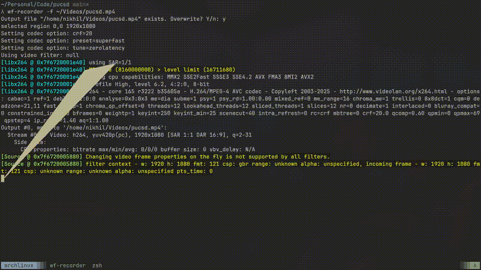

# PUCSD ASCII Triangle

A tiny terminal graphics experiment written in pure C.

This project renders and animates a colored recursive triangle directly inside the terminal using nothing but standard C, ANSI escape sequences, and a simple framebuffer-like window abstraction.

The triangle grows recursively to a configurable depth, then shrinks back down, creating a continuous breathing animation.

## Preview

<p align="center">
  
</p>

## Features

* Pure C implementation
* Recursive triangle generation
* ANSI color rendering
* Terminal-based framebuffer
* Dynamic centering
* Grow/shrink animation loop
* No external libraries

## How It Works

The animation is generated recursively.

Each triangle is composed of three smaller triangles:

* Top triangle (Red)
* Bottom-left triangle (Green)
* Bottom-right triangle (Blue)

The recursion continues until the base triangle is reached.

```text
       /\
      /__\
     /\  /\
    /__\/__\
```

Each frame:

1. Updates recursion depth
2. Clears the framebuffer
3. Regenerates the triangle
4. Renders colored output to the terminal
